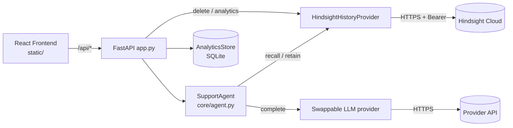
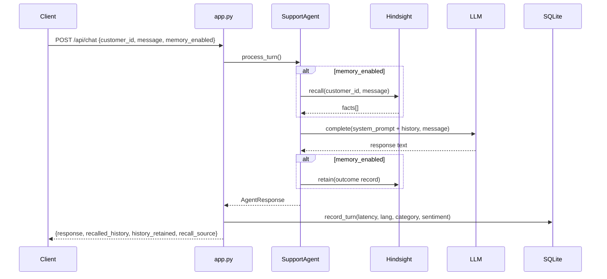

# Contextual Support Agent — Codebase Documentation

> A memory-powered customer-support agent. A FastAPI backend recalls each customer's history from **Hindsight** (persistent memory), feeds it to a swappable LLM provider, retains the outcome, and records real telemetry. A React + Vite frontend ships as pre-built static files served by the same backend.

Structure follows the CodeWiki convention: overview → architecture → module reference → data flow → operations → known gaps.

---

## 1. Overview

| Item | Value |
|---|---|
| Backend | Python 3.11+, FastAPI, Pydantic v2, httpx, SQLite |
| Frontend | React 19, Vite 8, Radix UI, lucide-react (no router, no state library) |
| LLM providers | Swappable adapters (`gemini`, `groq`) chosen via config; no model is baked in as a default |
| Current runtime | GPT-OSS 120B served via Groq; memory on Hindsight Cloud |
| Memory provider | Hindsight Cloud (`https://api.hindsight.vectorize.io`) |
| Telemetry store | SQLite (`data/analytics.sqlite3`) |
| API version | `2.1.0` |
| Deployment | Runs directly with `uvicorn` against Hindsight Cloud (Docker files exist but are no longer used, see §7) |

**Core loop per chat turn:** `Recall → Context → Response → Retain`

**Design rule:** no hardcoded data on the backend. Empty memory stays empty; unsupported metrics return `null`. Demonstration data is **synthetic**, written on purpose into real Hindsight banks by `seed_history.py`.

---

## 2. Repository Layout

```text
.
├── app.py                     # FastAPI app: routes, validation, error mapping, static serving
├── config.py                  # Env-driven Config dataclass
├── .env.example               # Provider-neutral env template
├── seed_history.py            # Seeds synthetic demo customers into real Hindsight banks
├── core/
│   └── agent.py               # SupportAgent — orchestrates recall/LLM/retain
├── providers/
│   ├── history.py             # HistoryProvider ABC + HistoryItem + error
│   ├── history_hindsight.py   # Async REST adapter for Hindsight
│   ├── llm.py                 # LLMProvider ABC + LLMProviderError (code, retryable)
│   ├── llm_gemini.py          # Gemini generateContent adapter
│   ├── llm_groq.py            # Groq adapter (SDK, HTTP fallback)
│   └── factory.py             # Picks providers from config
├── services/
│   └── analytics_store.py     # SQLite telemetry (turns, feedback) + summary
├── tests/                     # pytest suite (agent, API, Gemini) + unittest runner
├── frontend/                  # React/Vite source (see §6)
├── static/                    # Built frontend output (Vite outDir)
├── docs/                      # API, memory pipeline, installation notes
├── Dockerfile / docker-compose.yml   # Legacy: from before Hindsight Cloud credits; not in use
├── README.md / Start.md / CHANGELOG.md
└── requirements.txt / requirements-dev.txt
```

---

## 3. Architecture



**Layering**

1. **Transport** — `app.py` validates input, maps provider errors to stable HTTP responses, records telemetry.
2. **Domain** — `core/agent.py` holds the turn logic; it depends only on the two provider interfaces.
3. **Adapters** — `providers/*` implement `HistoryProvider` and `LLMProvider`. Swapping a provider means adding an adapter and a branch in `factory.py`.
4. **Persistence** — Hindsight (customer memory, remote) and SQLite (telemetry, local volume).

---

## 4. Backend Module Reference

### 4.1 `config.py`

`load_config()` reads environment variables (via `python-dotenv`, `override=True`) into a `Config` dataclass.

**Fail-fast:** `LLM_PROVIDER`, `LLM_MODEL` (legacy `GROQ_MODEL` accepted) and `HINDSIGHT_BASE_URL` are required. If any is missing, `ConfigError` is raised at startup naming the variables. There is no built-in provider or model. API keys are intentionally *not* required at load, so a missing key shows up as `degraded` / `not_configured` in `/health` and `/api/status` (the frontend recovery UI depends on this).

| Env var | Default | Notes |
|---|---|---|
| `LLM_PROVIDER` | **required** | `gemini` or `groq`; currently `groq` |
| `LLM_MODEL` | **required** | Any model the chosen provider serves; currently GPT-OSS 120B. Legacy `GROQ_MODEL` is read as a fallback |
| `GEMINI_API_KEY` | – | Only when `LLM_PROVIDER=gemini` |
| `GEMINI_BASE_URL` | `https://generativelanguage.googleapis.com/v1beta` | |
| `GROQ_API_KEY` | – | Only when `LLM_PROVIDER=groq` (current setup) |
| `HISTORY_PROVIDER` | `hindsight` | Only value supported |
| `HINDSIGHT_BASE_URL` | **required** | Hindsight Cloud URL (`https://api.hindsight.vectorize.io`) |
| `HINDSIGHT_API_KEY` | – | Bearer token |
| `AGENT_NAME` | `Support Assistant` | Injected into system prompt |
| `AGENT_PERSONA` | `You are a helpful, concise customer support agent.` | System prompt head |
| `REQUEST_TIMEOUT_SECONDS` | `30` | Min 1 |
| `MAX_RETRIES` | `2` | Min 0 |
| `ANALYTICS_DB_PATH` | `data/analytics.sqlite3` | |
| `ADMIN_API_KEY` | – | Required to enable memory deletion |
| `APP_ENV` | `development` | Label only |

### 4.2 `app.py` — HTTP layer

Module-level wiring creates the config, both providers, `SupportAgent`, and `AnalyticsStore` once at import time.

**Validation**
- `CUSTOMER_ID_PATTERN = ^[A-Za-z0-9][A-Za-z0-9._-]{0,63}$` — applied to every customer ID (body and path).
- `ChatRequest`: `message` 1–12000 chars, whitespace-trimmed; `conversation_id` ≤128.
- `FeedbackRequest`: `rating` 1–5, `outcome` ≤200, `corrected_resolution` ≤4000.
- All request-validation failures return `400 {"error": "Validation Error", ...}` (a generic message, by design).

**Heuristic classifiers (used only for telemetry)**
- `_detect_language` — Unicode range check: Telugu → `te`, Devanagari → `hi`, else `en`.
- `_classify_category` — keyword buckets: Security & Authentication, API Webhooks & Integration, Database & Performance, Infrastructure & Networking, Other. **First match wins**, in that order.
- `_classify_sentiment` — counts negative vs. positive keywords. These are heuristics, not LLM-graded.

**Endpoints**

| Method | Path | Purpose | Auth |
|---|---|---|---|
| GET | `/health` | Overall status; `healthy` only if Hindsight reachable **and** LLM configured | – |
| GET | `/api/status` | LLM/provider readiness snapshot | – |
| POST | `/api/chat` | One support turn (recall → LLM → retain) + telemetry | – |
| GET | `/api/history/{customer_id}` | Recall with query `"general customer history interactions"` | – |
| DELETE | `/api/history/{customer_id}` | Clear the customer's Hindsight memories | `X-Admin-API-Key` |
| POST | `/api/feedback` | Store rating/outcome/correction in SQLite **and** retain to Hindsight | – |
| GET | `/api/analytics` | 7-day telemetry summary + live Hindsight counts | – |
| GET | `/api/analytics/export` | Raw `turns` + `feedback` rows + summary | – |
| GET | `/api/customers` | Hard-coded preset directory (4 customers) | – |
| GET | `/` | Serves `static/index.html` | – |

Static mounts: `/assets` → `static/assets`, `/static` → `static/`.

**Error mapping for `/api/chat`**

| Cause | HTTP | Body |
|---|---|---|
| Agent `ValidationError` | 400 | `detail` |
| `LLMProviderError` | 502 | `{error, code, detail, retryable}` — `detail` picked per `code` (`not_configured`, `authentication`, `model_unavailable`, `rate_limited`, `timeout`/`network_error`/`upstream_unavailable`, `request_rejected`, else generic) |
| `HistoryProviderError` | 502 | `"Persistent customer memory is currently unavailable."` |
| Anything else | 500 | Generic internal error |

Raw provider errors are logged server-side only.

**Deletion guard order:** invalid ID → 400; `ADMIN_API_KEY` unset → 503; wrong/missing header → 401; else delete.

### 4.3 `core/agent.py` — `SupportAgent`

`process_turn(customer_id, user_message, *, memory_enabled=True) -> AgentResponse`

1. Validate non-empty inputs (raises `ValidationError`).
2. If memory enabled: `history_provider.recall(customer_id, query=message)`. Failures propagate as `HistoryProviderError`.
3. Build the system prompt: `persona` + `Agent Name` + `Persistent Memory: ENABLED|DISABLED` + a history block.
   - With results: lists facts and instructs the model to treat them as evidence only.
   - Without results: states no prior memory exists.
4. `llm_provider.complete(system_prompt, user_prompt)`. Empty output → `LLMProviderError`.
5. If memory enabled: retain an **outcome record** (not the assistant's answer): the cleaned customer message, a statement that resolution is unconfirmed, and up to 3 recalled facts. Retain failure is **logged, not raised** — the reply is still returned with `history_retained=False`.
6. Return `AgentResponse(response, recalled_history, customer_id, history_retained, memory_enabled, recall_source)`. `recall_source` is `"hindsight"` or `"disabled"`.

`_clean_memory_input` strips UI-only wrappers before retention/classification: `[File: ...]` notices and the trailing `(Please respond in Telugu|Hindi if appropriate for the customer)` hint.

> **WHY the answer isn't retained:** storing generated text as a "customer fact" would let the model's own claims pollute future recall.

### 4.4 `providers/`

**`history.py`** — `HistoryProvider` (async ABC): `recall`, `retain`, `delete`, `healthcheck`, optional `analytics_summary`. `HistoryItem` is a frozen dataclass (`text`, `memory_id`, `fact_type`, `context`, `scores`).

**`history_hindsight.py`** — `HindsightHistoryProvider`
- Uses `httpx.AsyncClient` directly (the sync Hindsight SDK caused event-loop errors under FastAPI).
- Retries on network errors, HTTP 429 and 5xx: `1 + MAX_RETRIES` attempts, linear backoff `0.5 s × attempt`.
- Bank ID = customer ID, URL-encoded with `quote(..., safe="")`.

| Operation | Call |
|---|---|
| recall | `POST /v1/default/banks/{id}/memories/recall` `{query}` — 404 → `[]` |
| retain | `POST /v1/default/banks/{id}/memories` `{async:false, items:[{content, context, timestamp}]}` |
| delete | `DELETE /v1/default/banks/{id}/memories` — returns `deleted_count`; 404 → `0` |
| health | `GET /health/ready` (timeout ≤5 s) |
| analytics | `GET /v1/default/banks` (paged, 100/page) + per-bank `stats/memories-timeseries?period=7d` → `bank_count`, `fact_count`, `memory_growth_data` |

Retention `context` values: `customer_support_interaction`, `customer_feedback_learning`, `seeded_customer_support_history`.

**`llm.py`** — `LLMProvider` ABC (`complete`, `is_configured`) and `LLMProviderError(message, code, retryable)`.

**`llm_gemini.py`** — `POST {base}/models/{model}:generateContent`, header `x-goog-api-key`, `temperature 0.3`, `maxOutputTokens 1024`. Status mapping: 401/403 → `authentication`; 404 → `model_unavailable`; 429 → `rate_limited` (retryable); ≥500 → `upstream_unavailable` (retryable); other 4xx → `request_rejected`. Empty candidates / blocked prompt → `empty_response`. Uses **synchronous** `httpx.Client` with `time.sleep` for backoff.

**`llm_groq.py`** — Uses the Groq SDK if importable, otherwise raw HTTP to `api.groq.com/openai/v1/chat/completions`. Same temperature/token limits. Error codes are less granular than the Gemini adapter's (only auth and rate-limit get codes), so failures on the current Groq setup mostly surface as the generic `provider_error`.

**`factory.py`** — `get_llm_provider(config)` (`gemini` | `groq`) and `get_history_provider(config)` (`hindsight`). Unknown values raise `ValueError` at startup.

### 4.5 `services/analytics_store.py` — `AnalyticsStore`

Thread-locked SQLite helper. Creates tables on init.

| Table | Columns |
|---|---|
| `turns` | `id, occurred_at, customer_id, conversation_id, memory_enabled, recall_count, retained, response_time_ms, language, category, sentiment` |
| `feedback` | `id, occurred_at, customer_id, conversation_id, message_id, rating, useful, outcome, corrected_resolution, hindsight_retained` |

`summary(days=7)` returns: `totalTurns`, `totalCustomers`, `activeCustomers`, `totalConversations` (only when clients send `conversation_id`, else `null`), `avgResponseTimeMs`, `csatScore`, `responsesUsingRecalledContextPercent` (= `recallHitRatePercent`), `retentionSuccessPercent`, `sentimentDistribution`, `languageUsageData`, `categoryBreakdown`, `trendData`, `memoryGrowthData`, `feedbackCount`. Values with no data are `null`. `/api/analytics` overwrites `memoriesStored`, `hindsightBankCount` and `memoryGrowthData` with live Hindsight numbers.

> **Note:** "recall hit rate" measures *coverage* (Hindsight returned ≥1 fact), not accuracy. Averages and totals are all-time; only `activeCustomers`, `trendData` and `memoryGrowthData` are windowed to 7 days.

### 4.6 `seed_history.py`

Checks Hindsight health (exits 1 if unreachable), then retains realistic records for `alex_chen` (Envoy/504 timeouts), `priya_patel` (Shopify webhooks), `marcus_vance` (Okta SAML). Run: `python seed_history.py`.

---

## 5. Data Flow

### 5.1 Chat turn



### 5.2 Feedback

`POST /api/feedback` → build a "Customer support feedback outcome…" text → `retain(context="customer_feedback_learning")`. If Hindsight fails, the endpoint returns 502 **and nothing is written to SQLite**. On success → `record_feedback` in SQLite → `{recorded: true, hindsight_retained: true}`.

### 5.3 Memory OFF

No recall, no retain, `recall_source: "disabled"`. Telemetry is still recorded.

---

## 6. Frontend (`frontend/`)

**Stack:** React 19 + Vite. `vite build` outputs to `../static` (`emptyOutDir: true`). Dev server on `5173` proxies `/api` → `http://127.0.0.1:8000`.

**Scripts:** `npm run dev`, `npm run build`, `npm run lint` (oxlint), `npm run preview`.

### 6.1 Structure

| Path | Role |
|---|---|
| `src/main.jsx`, `src/App.jsx` | Entry; `App` composes the whole layout and reads everything from `useChat()` |
| `src/hooks/useChat.js` | **Central state hook (~33 KB)**: theme, language, auth session, customers, conversations, memories, sending/retry/regenerate, feedback, analytics view-model, export |
| `src/hooks/useVoice.js` | Speech input |
| `src/services/api.js` | Backend client: `fetchSystemStatus`, `fetchCustomers`, `fetchCustomerHistory`, `sendChatMessage`; `SupportApiError {status, code, retryable}` |
| `src/services/storage.js` | `localStorage` persistence (theme, language, customers, conversations, memories, feedback) |
| `src/i18n/translations.js` | UI strings (English / Hindi / Telugu) |
| `src/styles/` | `tokens.css` (design tokens), `global.css` |

### 6.2 Components (`src/components/`)

| Folder | Purpose |
|---|---|
| `Header`, `Sidebar`, `CustomerSwitcher` | Navigation, conversation list, customer selection |
| `Chat` | `ConversationView`, `MessageBubble`, `ChatInput`, `MarkdownRenderer`, `FileUpload`/`FilePreview`, `QuickPrompts`, `MemorySummaryCard` |
| `RecallContext` | Panel showing facts recalled for the current turn |
| `MemoryVisualization` | Timeline, pipeline flow, visualization panel |
| `CustomerProfile` | Customer profile card |
| `KnowledgeBase` | Article browser; can send a question to chat |
| `Analytics` | Analytics dashboard |
| `Admin` | Admin dashboard |
| `Auth` | Login modal, session-timeout modal, profile drawer (15-minute session) |
| `Feedback` | Per-message feedback widget |
| `Voice` | Waveform |
| `UI` | Button, Badge, Modal, Toast, SkeletonLoader, OfflineBanner, KeyboardShortcutsModal |

**Views** (`activeView`): chat, memory, customer, knowledge base, analytics, admin. **Shortcuts:** `Ctrl/Cmd + /` opens help; `Alt + N` starts a new chat.

### 6.3 Frontend ↔ backend wiring today

| Backend endpoint | Used by frontend? |
|---|---|
| `/api/status`, `/api/customers`, `/api/history/{id}`, `/api/chat` | Yes (`api.js`) |
| `/api/feedback`, `/api/analytics`, `/api/analytics/export`, `DELETE /api/history/{id}` | **No** — feedback, analytics and memory deletion are handled in `localStorage` / local state |

---

## 7. Build, Run, Deploy

### Local

```bash
python -m venv .venv && source .venv/bin/activate      # Windows: .venv\Scripts\activate
pip install -r requirements.txt -r requirements-dev.txt
cp .env.example .env
# Set LLM_PROVIDER, LLM_MODEL, the provider API key, HINDSIGHT_BASE_URL, HINDSIGHT_API_KEY, ADMIN_API_KEY
uvicorn app:app --host 127.0.0.1 --port 8000 --reload
# Optional frontend dev
cd frontend && npm install && npm run dev
```

- API docs: `/docs`, `/redoc`. Health: `/health`.
- Seed demo memory: `python seed_history.py`.

### Docker (legacy, not in use)

Docker was the original path, used only while the Hindsight Cloud credits were failing to redeem. With Cloud credits active, the project runs without it. The files remain in the repo for reference:

- `Dockerfile` — Stage 1 (`node:20-alpine`) builds the frontend into `/app/static`; Stage 2 (`python:3.11-slim`) copies the backend and built `static/`.
- `docker-compose.yml` — starts only the backend (Hindsight is remote); volume `analytics-data` → `/app/data`.
- `LLM_PROVIDER` and `LLM_MODEL` are now passed through without defaults, matching the fail-fast config.

### Tests

```bash
python -m pytest tests/ -v
```

- `test_agent.py` — success, memory OFF, retention content, validation, empty history.
- `test_api.py` — health/degraded, status, customers, validation, telemetry, LLM/Hindsight failure mapping, feedback, delete auth, analytics empty state.
- `test_llm_gemini.py` — missing key, response parsing, factory selection.
- `conftest.py` — placeholder env (provider, model, Hindsight URL) so the app can import under fail-fast config; providers are stubbed.
- `test_api.py` also covers the config fail-fast and legacy `GROQ_MODEL` fallback.
- `run_tests.py` — a small `unittest` duplicate of the agent tests.
- Tests use stub async providers; no network calls. Current run: 24 passed.

---

## 8. Known Gaps and Inconsistencies

Found while reading the code; verify before relying on them.

1. **Frontend source is incomplete.** `useChat.js`, `storage.js` import `src/data/demoData.js`, and `KnowledgeBaseView.jsx` imports `src/data/knowledgeBaseData.js`. Neither exists in the archive, so `npm run build` will fail from source. Likely cause: `.gitignore` contains a bare `data/` rule (meant for the SQLite folder) which also matches `frontend/src/data/`. Fix: change it to `/data/`.
2. **`static/` is committed build output** (~500 KB JS bundle) and may not match current `frontend/src`. It is overwritten on every `npm run build`.
3. **Frontend keeps its own demo data, local feedback, local analytics and a local admin PIN.** Real backend endpoints for these exist but aren't wired (see §6.3). README and CHANGELOG say the frontend is untouched, while other CHANGELOG entries and file timestamps show frontend edits — treat those statements as historical.
4. **Doc drift (remaining):** `CHANGELOG.md` entries before 2026-09-29 still describe Gemini as the default and a local Hindsight container. They are historical; the newest entry supersedes them. `Start.md` and `README.md` still contain Docker sections that are no longer part of the workflow.
5. **Code notes**
   - `history_hindsight.py` builds the retain timestamp with inline `__import__("datetime")`; replace with a normal import.
   - Both LLM adapters are synchronous and are called from an `async` route, so a slow LLM call blocks the event loop. Consider `run_in_threadpool` or `httpx.AsyncClient`.
   - `history_hindsight.py` imports `time` unused; `llm_gemini.py` uses it.
   - Groq's retry logic distinguishes auth errors by string matching on the message.
   - `PRESET_CUSTOMERS` in `app.py` is a hardcoded list (matches the synthetic seed customers); fine for demos, but not data-driven.
   - `/api/feedback`, `/api/history` (GET) and `/api/analytics*` have no authentication; only DELETE is protected. Analytics export exposes raw customer IDs and feedback text.
   - `SupportAgent._clean_memory_input` is a private method called from `app.py`.
6. **Rate/cost note:** every memory-enabled turn makes two Hindsight calls plus one LLM call; the Hindsight Cloud balance returns HTTP 402 when exhausted (surfaced as a generic 502 memory-unavailable message).

---

## 9. Extending the System

| Task | Where |
|---|---|
| Add an LLM provider | New `providers/llm_<name>.py` implementing `LLMProvider`; add a branch in `factory.get_llm_provider`; add env vars in `config.py` |
| Add a memory backend | Implement `HistoryProvider`; branch in `factory.get_history_provider` |
| Add an endpoint | `app.py`; add a Pydantic model; reuse `_validate_customer_id` |
| Add an analytics metric | New column/query in `analytics_store.py` → surface in `summary()`; return `null` when unsupported |
| Change the persona | `AGENT_NAME` / `AGENT_PERSONA` env vars — no code change |
| Wire frontend to real feedback/analytics/delete | Add functions to `src/services/api.js`, call from `useChat.js` (`submitMessageFeedback`, `analyticsData`, `handleDeleteCustomerMemory`) |

---

## 10. Glossary

- **Bank** — Hindsight's per-customer memory container (bank ID = customer ID).
- **Recall / Retain** — Read from / write to a bank.
- **Fact** — A memory unit Hindsight extracts from retained content.
- **Memory ON/OFF** — Per-request `memory_enabled` flag.
- **Recall coverage** — Share of memory-enabled turns where recall returned ≥1 fact.
